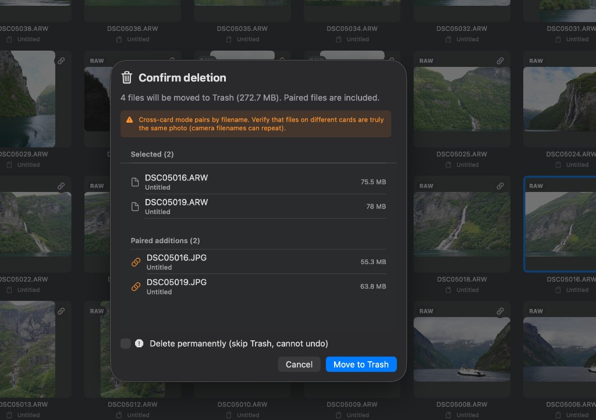

# Siftly

**Windows edition:** a Tauri / Rust client is available in [`windows/`](windows/README.md), with EXE / MSI build automation. The documentation below describes the macOS application.

A lightweight macOS media manager for photographers working directly on storage cards. Cull on the card, then **import the keepers to your computer** with verified copies. Siftly uses a **lightweight index** — it never modifies your originals and stays memory-friendly on large SD / CFexpress cards.

Its standout feature is **RAW/JPG paired deletion by filename**: delete one file and matching companions are removed together. Deletions go to the macOS Trash by default (⌘Z undo), or you can **delete permanently** (skip Trash, irreversible).

> **Note:** on a removable card, the macOS Trash is a folder *on the card*, so moving files there does not free space until you empty it. Use permanent deletion (or import-then-delete) to reclaim space immediately.

**Languages:** English (default) and Simplified Chinese — follows your macOS system language by default, or pick a specific language in **Settings → Language**.

[中文文档](README.zh-Hans.md)

---

## Screenshots

| Non-destructive editor | RAW/JPG paired deletion |
| --- | --- |
|  |  |

---

## Features

### Core
- Auto-detects removable SD / CFexpress volumes with hot-plug refresh
- Thumbnail grid for Sony ARW, Canon CR2/CR3, Nikon NEF/NRW, Fuji RAF, JPG/HEIC/PNG, and more
- **Video too** (MOV/MP4/M4V/MTS/…), so the grid agrees with the Finder about how full the card is
- **Multi-brand pairing presets**: Universal / Sony / Canon / Nikon / Fuji (toolbar link icon)
- **RAW/JPG paired deletion**: same base name + compatible extensions in one folder → delete one, delete all
- **Cross-card pairing**: browse all cards together; match by filename across cards (dual-slot RAW+JPG on separate cards)
- Batch delete with full confirmation list (selected + paired additions, per-card labels)
- **Two delete modes**: Move to Trash (undo with ⌘Z) or delete permanently

### Import to computer
- Copy from the card to any folder, with a **checksum verification** of every file
- Organize into `One folder` / `By date` / `By year and month` / `By date, then type` (`2026-08-19/RAW`, `/JPEG`, `/Video`)
- **Re-importing the same card copies nothing** — same-name, same-size candidates are compared by checksum before being skipped
- Different photos that share a name (counter reset, two cards) are kept side by side, never overwritten
- Optionally **move originals to Trash after a verified copy** — only files that copied *and* verified are removed
- Checks free space up front; copies are staged privately and published without overwriting existing files. Cancelling removes staged partial files. Cleanup always requires checksum verification.
- Capture timestamps are preserved on the copies

### Browse & view
- **Full-screen preview**: ←/→ or scroll wheel, pinch/double-click/⌘+/⌘- zoom, pan, ⌘0 fit, 0–5 rating, space to toggle selection, Delete, Esc/⌘W close
- **EXIF overlay** in preview (toggle with `I` or info button; preference remembered)
- **Selection**: click, ⌘+click, Shift+click range, marquee drag (⌘+drag to add)
- Context menu: preview, Reveal in Finder, open, rate, label, copy name/path, Trash
- Search, filter (All/RAW/JPG/Paired/Unpaired), rating/label filters, sort
- Batch: select all (⌘A / Ctrl+A), invert (⌘I), clear (⌘D), batch rating/labels

### Keyboard shortcuts
- **Grid**: ⌘A/Ctrl+A select all, ⌘I invert, ⌘D clear, Shift+click range, marquee, Delete/⌘⌫ Trash, ⌘Z undo
- **Preview**: ←/→ or scroll, space, 0–5 stars, `I` toggle EXIF, ⌘+/⌘-/⌘0 zoom, ⌘E edit, Delete, Esc/⌘W close
- **Editor**: ⌘W/Esc close; Return to finish crop

### Simple editing (non-destructive)
- Edit from context menu or preview — **originals are never modified**; export saves a new file
- Live preview for RAW (Core Image) and JPG/HEIC/PNG/TIFF
- Light, color, detail, tone curve, HDR
- Rotate, flip, straighten, **auto level** (Vision horizon), interactive crop with aspect presets
- Export / convert / compress: JPEG, HEIC, PNG, TIFF with quality and optional long-edge resize

### Marks & info
- Star ratings (0–5) and color labels, persisted in a lightweight index, namespaced per card
- **XMP sidecars** (optional): hand single or batch ratings to Lightroom / Capture One / Bridge, or import ratings back. Updating or clearing marks preserves other editing metadata in existing sidecars.
- Editor adjustments are remembered per photo — reopen and your edit is still there
- Inspector panel with EXIF (dimensions, camera, lens, ISO, aperture, shutter, focal length, date)

### About / Sponsor
- **Siftly → About Siftly** (Help menu removed)
- WeChat / Alipay QR codes + [PayPal](https://www.paypal.com/paypalme/yinxu0619)

### Performance
- Streaming scan — batches are coalesced, file indexes updated incrementally, and filtering/sorting run in the background
- Lazy thumbnails with ~256 MB memory cap, size-bucketed so the zoom slider is free
- Decodes are coalesced, concurrency-capped (the card reader is the bottleneck) and **dropped when you scroll past them**, so a fling doesn't queue thousands of stale decodes
- Queued prefetches are promoted when you open a photo; obsolete neighbor requests and queued editor renders are cancelled
- **Preview prefetch cache** (Settings ⌘, — default 3 neighbors per side; 0 = off)
- O(n) pairing; batched background delete with progress
- Mark persistence coalesces edits on a background queue and flushes on normal app exit

### Settings (⌘,)
- Prefetch adjacent photos (0–20 per side)
- Write XMP sidecars when rating/labeling; import marks from existing sidecars
- Interface language

---

## Requirements

- macOS 14 (Sonoma) or later
- Xcode 15+ / Swift 5.9+ (tested with Xcode 26, Swift 6.3)

## Build & run

```bash
swift build
swift run
swift test
```

If SwiftPM cannot write to the default cache (CI/sandbox), use:

```bash
chmod +x scripts/dev.sh
./scripts/dev.sh build
./scripts/dev.sh run
./scripts/dev.sh test
```

Grant **Full Disk Access** or **Files and Folders** in System Settings if scanning fails.

### Package as `.app`

```bash
chmod +x scripts/package_app.sh
./scripts/package_app.sh
open dist/Siftly.app
```

Output: `dist/Siftly.app` and `dist/Siftly.zip` (universal arm64 + x86_64). First launch may require right-click → Open if Gatekeeper blocks unsigned builds.

### Open in Xcode

```bash
open Package.swift
```

---

## Usage

1. Insert a card → select it in the sidebar → scan starts automatically.
2. Grid: click to select, ⌘+click multi-select, double-click preview, right-click for actions.
3. Delete: select files → Trash (or Delete) → review list → confirm. Toggle permanent delete if needed.
4. Undo: ⌘Z restores the last Trash deletion (not permanent deletes).
5. Edit: context menu or preview → adjust → Export to a new file.

### Cross-card dual-slot workflow

1. Insert both cards.
2. Select **All Storage Cards** (when ≥2 cards detected).
3. Pairing matches by filename across cards; deletion list shows which card each file is on.

> Camera filenames repeat across shoots — verify thumbnails and card names before cross-card delete.

### Pairing presets

| Preset | Extensions |
| --- | --- |
| Universal (default) | All supported RAW + jpg/jpeg/heic/heif |
| Sony | arw + JPG/HEIC |
| Canon | cr2/cr3 + JPG/HEIC |
| Nikon | nef/nrw + JPG/HEIC |
| Fuji | raf + JPG/HEIC |

---

## Architecture

| Layer | Path | Key types |
| --- | --- | --- |
| Scan | `Sources/SiftlyKit/DiskScan` | `Volume`, `MediaFile` |
| Pairing | `Sources/SiftlyKit/Pairing` | `PairingRule`, `PairingEngine`, `DeletionPlanner` |
| Editing | `Sources/SiftlyKit/Editing` | `ImageAdjustments`, `ImageProcessor`, `ExportSettings` |
| Platform | `Sources/SiftlyKit/Platform` | `VolumeService`, `FileSystemService`, `TrashService`, `ThumbnailService` |
| UI | `Sources/SiftlyKit/UI` | SwiftUI views |
| Localization | `Sources/SiftlyKit/Localization` | `L10n`, `Resources/Localizable.xcstrings` |
| App | `Sources/SiftlyKit/App` | `AppState`, `SiftlyApp` |

`SiftlyKit` is a library (testable); `Siftly` is a thin executable host.

---

## Localization

- Source language: **English** (`defaultLocalization: "en"` in `Package.swift`)
- Translations: `Sources/SiftlyKit/Resources/Localizable.xcstrings` (Simplified Chinese included)
- UI strings go through `L10n` in `Sources/SiftlyKit/Localization/L10n.swift`
- To add a locale: add translations to the `.xcstrings` catalog

---

## Tests

```bash
swift test
```

Covers pairing, deletion planning, scanning, editing models, and utilities.

---

## Sponsor

If Siftly helps your workflow, consider buying the author a coffee ☕️

<table>
  <tr>
    <td align="center"><b>WeChat</b></td>
    <td align="center"><b>Alipay</b></td>
  </tr>
  <tr>
    <td align="center"></td>
    <td align="center"></td>
  </tr>
</table>

**PayPal:** [paypal.me/yinxu0619](https://www.paypal.com/paypalme/yinxu0619)
