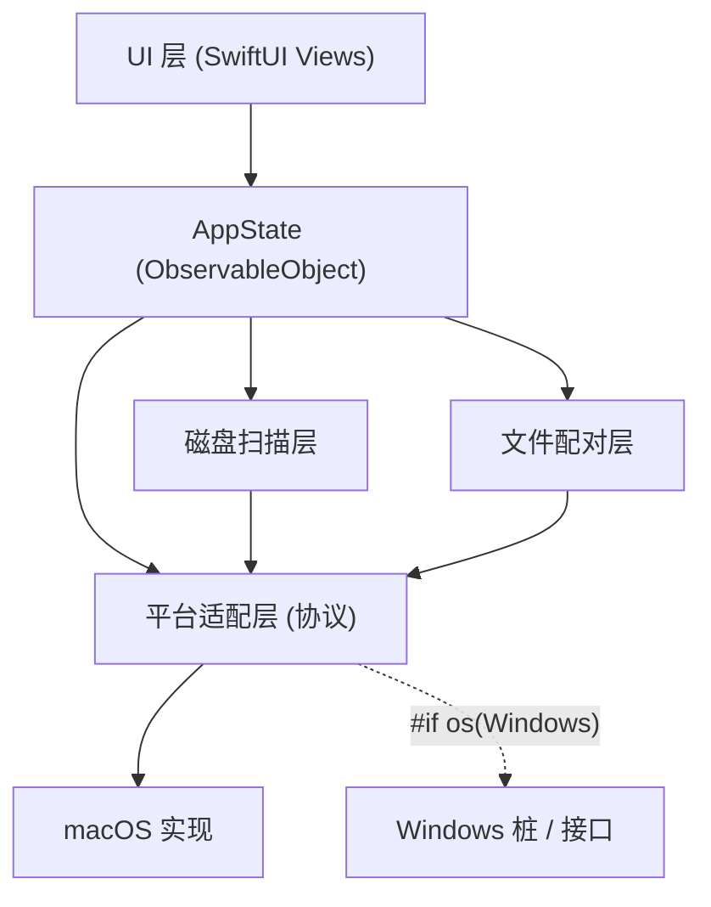

# Siftly

一款面向摄影师的 macOS 存储卡素材管理工具。Siftly 采用**轻量索引模式**——不复制原图，直接操作存储卡上的原始文件，适配大容量 SD / CFexpress 卡，低内存占用。

**界面语言**：跟随 macOS 系统语言，支持**简体中文**与**英文**（开发语言为英文）。英文 README 见 [README.md](README.md)。

核心差异化能力：**RAW/JPG 文件名配对联动删除**。删除任意一张，自动同步删除同名配对文件。删除默认移入 macOS 废纸篓并支持一键撤销，也可选择**直接删除（不进废纸篓、不可恢复）**以省去清空废纸篓的步骤。

---

## 功能清单

### 核心
- 自动识别挂载的 SD / CFexpress 等可移除存储卡，支持热插拔自动刷新
- 网格缩略图预览，支持索尼 ARW、佳能 CR2/CR3、尼康 NEF/NRW、富士 RAF 等主流 RAW 与 JPG/HEIC/PNG 等常见格式
- **多品牌配对预设**：工具栏「配对规则」一键切换 通用 / 索尼 / 佳能 / 尼康 / 富士，默认「通用」即可识别各家 RAW + JPG/HEIC 同名配对
- **RAW/JPG 配对联动删除**：同目录同基础名的不同后缀文件自动配对，删除一个同步删除全部配对项
- **跨卡同名配对（双卡分录）**：左侧选「所有存储卡」后合并浏览全部卡，按文件名跨卡配对——在 RAW 卡删一张 `DSC00370.ARW`，另一张卡上同名 `DSC00370.JPG` 一并删除
- 批量删除前汇总完整待删清单（含配对联动项、标注所属卡），二次确认后执行
- **两种删除方式**：默认「移入废纸篓」（可 ⌘Z 撤销）；勾选「直接删除」则从存储卡永久删除、不可恢复

### 浏览与查看
- 双击进入**大图预览**：← / → 翻页、**鼠标滚轮上下切换照片**、捏合/双击/⌘+/⌘- 缩放、拖拽平移、⌘0 适应、数字键 0–5 评分、空格切换选中、Delete 删除、Esc/⌘W 关闭
- **大图预览叠加 EXIF 信息**：右下角「照片信息」浮层显示尺寸/相机/镜头/曝光/焦距/拍摄时间等，按 `I` 或点信息按钮可随时开关（设置自动记忆）
- **选择方式**：单击单选、⌘+单击多选、**Shift+单击范围连选**、在空白处**拖拽框选**（按住 ⌘ 拖拽则叠加到已选）
- **右键菜单**：打开大图、在访达中显示、用默认应用打开、评分、标签、拷贝文件名/路径、移入废纸篓
- **搜索 / 筛选 / 排序**：按文件名搜索；按 全部 / RAW / JPG / 已配对 / 未配对 过滤；按最低星级、彩色标签过滤；按时间 / 文件名 / 大小升降序排序
- **批量操作**：全选 (⌘A / ⌃A)、反选 (⌘I)、取消选择 (⌘D)、批量评分、批量标签

### 快捷键
- **网格**：⌘A / ⌃A 全选、⌘I 反选、⌘D 取消选择、Shift+单击连选、空白处拖拽框选、Delete 或 ⌘⌫ 移入废纸篓、⌘Z 撤销删除
- **大图预览**：← / → 或鼠标滚轮翻页、空格切换选中、0–5 评分、`I` 开关照片信息、⌘+/⌘-/⌘0 缩放、⌘E 编辑、Delete 删除、Esc/⌘W 关闭
- **编辑器**：⌘W/Esc 关闭；裁切模式下 Return 完成

### 简单后期（非破坏式编辑）
- 右键菜单或大图预览里的「编辑 / 后期」进入编辑器，**绝不修改原图**，编辑结果导出为新文件
- 实时预览，支持 RAW（经 Core Image 解码）与 JPG/HEIC/PNG/TIFF
- 光效：曝光、亮度、对比度、高光、阴影、**HDR**（局部色调 + 对比增强）
- 色彩：饱和度、自然饱和度、色温、色调
- 细节：锐化、暗角
- **旋转 / 校平**：左右 90° 旋转、水平翻转、±45° 微调校平，以及 **「自动调平」**（基于 Vision 识别地平线一键摆正，自动裁掉旋转留白）
- **裁切**：交互式裁切框（可拖动四角与移动），内置比例预设（自由 / 原始 / 1:1 / 3:2 / 2:3 / 4:3 / 3:4 / 16:9），三分构图参考线
- **曲线**：可拖动的 RGB 主曲线（在曲线上拖动加点、右键删点）
- 按住「对比原图」可即时对比；一键重置全部
- **导出 / 格式转换 / 压缩**：JPEG / HEIC / PNG / TIFF 互转，JPEG/HEIC 质量可调，可选「长边尺寸」缩放压缩；导出到原文件夹（自动 `-edited` 命名）或「另存为…」

### 标记与信息
- 星级（0–5）与彩色标签标记，持久化保存（侧车索引，不修改原文件）
- 侧边栏展示 EXIF 基础信息（尺寸、相机、镜头、ISO、光圈、快门、焦距、拍摄时间）

### 关于 / 赞助
- 菜单栏 **Siftly → 关于 Siftly** 打开「关于」面板（已移除默认 Help 菜单）
- 赞助支持：**微信 / 支付宝**收款码 + **PayPal** 在线赞助（[paypal.me/yinxu0619](https://www.paypal.com/paypalme/yinxu0619)）

### 性能
- 分批流式扫描，发现即显示，不一次性读取全部文件元数据
- 缩略图懒加载 + 基于内存占用的缓存淘汰（默认上限约 256 MB），滚动流畅
- **大图预览预加载缓存**：打开大图后在后台提前解码前后相邻照片（RAW 解码较慢，预加载后翻页几乎瞬开）；数量可在 **设置（⌘,）** 中调整（默认每侧 3 张，0 = 关闭），相同照片的并发请求会自动合并、避免重复解码
- 配对算法 O(n)，千张文件秒级完成
- 批量删除分批后台执行，带进度提示，不阻塞 UI

### 设置（⌘,）
- **预加载相邻照片**：调节大图预览的预加载张数（每侧 0–20），权衡流畅度与内存占用；设置自动保存

### 安全兜底
- 删除二次确认 + 完整清单
- 废纸篓失败、文件被占用 → 逐项兜底并汇总报错，不中断整体
- 热插拔中途扫描/删除的状态保护，过期结果不会回填，避免崩溃
- 权限不足 / 目录访问失败的友好中文提示

---

## 环境要求

- macOS 14 (Sonoma) 或更高
- Xcode 15+ / Swift 5.9+（开发与编译机已验证：Xcode 26、Swift 6.3）

## 编译与运行

最简单的方式（推荐）：

```bash
swift build      # 编译
swift run        # 运行
swift test       # 运行单元测试
```

如果你的环境对默认的 `~/Library` SwiftPM 缓存目录没有写权限（如部分 CI / 沙箱），改用随仓库附带的脚本，它会把所有缓存收敛到仓库内：

```bash
chmod +x scripts/dev.sh
./scripts/dev.sh build
./scripts/dev.sh run
./scripts/dev.sh test
```

> 首次运行后，macOS 可能会请求授予访问可移除卷/文件夹的权限。若扫描提示权限不足，请在
> 「系统设置 → 隐私与安全性 → 完全磁盘访问权限 / 文件与文件夹」中授权 Siftly。

### 打包成可直接打开的应用程序

生成一个可双击运行的 `Siftly.app`（release 编译 + 组装 bundle + ad-hoc 签名）：

```bash
chmod +x scripts/package_app.sh
./scripts/package_app.sh
open dist/Siftly.app          # 或在 Finder 双击
```

产物位于 `dist/Siftly.app`，可拖入「应用程序」文件夹。首次打开若被 Gatekeeper 拦截（未用开发者证书签名），右键 → 打开，或在「系统设置 → 隐私与安全性」中点「仍要打开」。

应用图标源图为 `assets/AppIcon-square.png`，打包时会自动生成 `assets/AppIcon.icns` 并嵌入 bundle。要更换图标，替换源图后重新运行 `./scripts/make_icns.sh` 再打包即可。

### 在 Xcode 中打开

```bash
open Package.swift   # 用 Xcode 打开 SPM 工程，选择 "Siftly" scheme 运行
```

---

## 使用说明

1. 插入存储卡（或读卡器），Siftly 自动在左侧「存储卡」列表中列出，点击选中即开始扫描。
2. 中间网格区域展示缩略图：
   - 单击选中（再次单击其它图切换），⌘+单击多选。
   - **双击打开大图预览**：支持 ← / → 或鼠标滚轮切换、星级评分、Delete 删除（含配对，⌘Z 可撤销）、Esc 或 ⌘W 关闭。
   - **右键菜单**：打开大图、在访达中显示、用默认应用打开、评分、标签、拷贝文件名/路径、移入废纸篓。
   - RAW 文件左上角有 `RAW` 角标；存在配对文件的右上角有链接图标。
   - 右下角显示星级，左下角显示彩色标签。
   - 顶部滑块调节缩略图大小。
3. 右侧信息栏展示当前文件的大小、修改时间、配对情况、EXIF，以及星级/标签设置。
4. 删除：选中若干文件后点工具栏垃圾桶图标（或按 Delete 键）→ 弹出**完整待删清单**（区分「已选择」与「配对联动」）→ 可勾选「直接删除（不进废纸篓，不可恢复）」→ 二次确认 → 执行并显示进度。
5. 撤销：移入废纸篓的删除可点工具栏撤销图标或按 ⌘Z 恢复最近一次；「直接删除」为永久删除，无法撤销。
6. 刷新：左上角刷新按钮重新检测存储卡并重扫当前卡。
7. 后期：右键「编辑 / 后期…」或大图预览里「编辑」进入编辑器 → 调整光效/色彩/曲线、旋转/校平（含「自动调平」）、点「裁切」拖动裁切框并选比例 → 「导出」保存为新文件（原图不变）。

### 自定义配对规则

配对规则由 [`PairingRule`](Sources/SiftlyKit/Pairing/PairingRule.swift) 描述。内置 5 套预设，可在工具栏「配对规则」菜单（链条图标）一键切换，切换后即时重算配对、无需重扫：

| 预设 | 配对扩展名 |
| --- | --- |
| 通用（默认） | 所有支持的 RAW + `jpg/jpeg/heic/heif` |
| 索尼 | `arw` + JPG/HEIC |
| 佳能 | `cr2/cr3` + JPG/HEIC |
| 尼康 | `nef/nrw` + JPG/HEIC |
| 富士 | `raf` + JPG/HEIC |

```swift
PairingRule.universal // 通用：各家 RAW 同名即与 JPG/HEIC 配对
PairingRule(name: "佳能 CR2/CR3 + JPG", groups: [["cr2", "cr3", "jpg", "jpeg", "heic", "heif"]])
```

`groups` 中每个数组是一组「可互相配对」的扩展名；只有同目录、同基础名（默认大小写不敏感）、且扩展名属于**同一组**的文件才会配对（跨卡模式下忽略目录，仅按文件名）。

### 双卡分录的「跨卡同步删除」

如果你用相机双卡槽分录（一张卡录 RAW、一张卡录 JPG，两张卡上同一张照片**文件名相同**）：

1. 同时插入两张卡；
2. 左侧选择顶部的「所有存储卡」（仅当检测到 ≥2 张卡时出现）进入**跨卡模式**；
3. 此时配对忽略「目录/所在卡」，只按文件名匹配。删除某张 `DSC00370.ARW`，会自动把另一张卡上的 `DSC00370.JPG` 一并列入待删清单并同步移入废纸篓；
4. 待删清单会标注每个文件所属的卡，便于核对；缩略图下方也会显示卡名。

> 注意：相机文件名会循环复用（如不同批次都可能出现 `DSC00370`）。跨卡按名配对前，请借助清单中的缩略图/卡名确认确实是同一张照片，避免误删名字相同但内容不同的旧文件。删除仍可用 ⌘Z 撤销。

---

## 架构

分层清晰，平台相关代码集中在「平台适配层」，为 Windows 移植预留接口。



| 层 | 目录 | 关键类型 |
| --- | --- | --- |
| 磁盘扫描层 | [`Sources/SiftlyKit/DiskScan`](Sources/SiftlyKit/DiskScan) | `Volume`、`MediaFile` |
| 文件配对层 | [`Sources/SiftlyKit/Pairing`](Sources/SiftlyKit/Pairing) | `PairingRule`、`PairingEngine`、`DeletionPlanner` |
| 后期编辑层 | [`Sources/SiftlyKit/Editing`](Sources/SiftlyKit/Editing) | `ImageAdjustments`（含旋转/校平/裁切几何）、`ToneCurve`、`ImagePipeline`、`ImageProcessor`（Core Image 渲染 + Vision 自动调平）、`ExportSettings` |
| 平台适配层 | [`Sources/SiftlyKit/Platform`](Sources/SiftlyKit/Platform) | `VolumeService`、`FileSystemService`、`TrashService`、`ThumbnailService` |
| UI 层 | [`Sources/SiftlyKit/UI`](Sources/SiftlyKit/UI) | `ContentView`、`ThumbnailGridView`、`InspectorView`、`DeleteConfirmationView` |
| 应用状态 | [`Sources/SiftlyKit/App`](Sources/SiftlyKit/App) | `AppState`、`SiftlyApp` |

工程被拆成一个库 target（`SiftlyKit`，含全部逻辑与 UI，可单测）与一个极薄的可执行 target（`Siftly`，仅 `SiftlyApp.main()`）。

---

## Windows 适配点（预留接口）

第一期为 macOS 完整实现。所有平台相关逻辑都隐藏在 [`PlatformServices.swift`](Sources/SiftlyKit/Platform/PlatformServices.swift) 定义的 4 个协议之后，移植时只需提供 Windows 实现，**不必改动 UI / 扫描 / 配对层**。

修改点集中在两处：

1. **服务实现**：[`Sources/SiftlyKit/Platform/Windows/WindowsServiceStubs.swift`](Sources/SiftlyKit/Platform/Windows/WindowsServiceStubs.swift)（已用 `#if os(Windows)` 占位）
   - `WindowsVolumeService`：`GetLogicalDrives` / `SetupAPI` 枚举驱动器，监听 `WM_DEVICECHANGE` 热插拔
   - `WindowsFileSystemService`：目录遍历（Foundation 在 Swift for Windows 上基本可移植）
   - `WindowsTrashService`：`SHFileOperation`（`FOF_ALLOWUNDO`）/ `IFileOperation` 实现回收站与恢复
   - `WindowsThumbnailService`：`IShellItemImageFactory` / WIC
2. **服务装配**：[`AppState.init`](Sources/SiftlyKit/App/AppState.swift) 中的 `#if os(macOS) / #elseif os(Windows)` 分支已就绪。

UI 层目前直接使用 `NSImage`（见 `ThumbnailProvider` 与 `ThumbnailItemView`），Windows 移植时需将其抽象为跨平台的图像类型（例如统一返回 `CGImage` 并在视图层做平台转换）。

---

## 后续可扩展功能建议

- 配对规则的可视化编辑界面（多套品牌预设已支持一键切换，待补充自定义规则编辑）
- 复制/导入到本地图库、按日期/相机自动归类
- 全屏大图查看、左右切换、键盘评级（1–5 直接打星）
- 筛选与排序（按星级、标签、格式、配对状态、拍摄时间）
- 视频文件（MP4/MOV）支持与配对（如 `.ARW + .MP4` 同名）
- 重复/相似照片检测，一键清理
- 安全擦除/格式化存储卡（带强校验）
- iCloud / 网络位置只读浏览

---

## 测试

```bash
swift test        # 或 ./scripts/dev.sh test
```

覆盖：配对引擎（基础配对、单文件、跨目录、多后缀、大小写、分组隔离）、删除规划（配对扩展、去重、无配对）、流式扫描（扩展过滤 + 分批）、编辑模型（调整项、色调曲线、导出格式）、工具方法与索引键格式。

---

## 赞助 / Sponsor

如果 Siftly 帮到了你，欢迎请作者喝杯咖啡 ☕️ —— 你的支持是它持续更新的动力！

If Siftly helps you, consider buying the author a coffee. Thank you! 🙏

<table>
  <tr>
    <td align="center"><b>微信 / WeChat</b></td>
    <td align="center"><b>支付宝 / Alipay</b></td>
  </tr>
  <tr>
    <td align="center"></td>
    <td align="center"></td>
  </tr>
</table>

**PayPal**：[paypal.me/yinxu0619](https://www.paypal.com/paypalme/yinxu0619)
